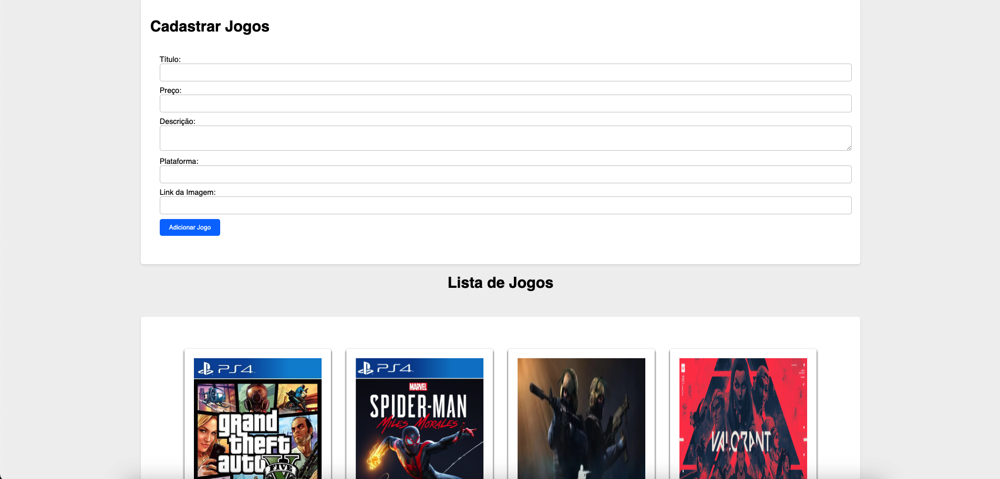

# Catálogo de Jogos

# Projeto de Lista de Jogos

Este é um projeto simples para criar e exibir uma lista de jogos em uma página da web. Ele usa JavaScript para adicionar jogos à lista e exibi-los na página. Abaixo estão os detalhes sobre como o projeto funciona e como você pode usá-lo.

## Como Funciona

O projeto consiste em duas classes principais e algumas funções JavaScript auxiliares:

### Classe Game

A classe Game representa um jogo com as seguintes propriedades:

- **titulo**: O título do jogo.
- **preco**: O preço do jogo.
- **descricao**: Uma breve descrição do jogo.
- **plataforma**: A plataforma em que o jogo está disponível.
- **imagem**: Uma URL para a imagem do jogo.

### Classe GamesList

A classe GamesList é responsável por manter uma lista de jogos e possui os seguintes métodos:

- `adicionarJogo(titulo, preco, descricao, plataforma, imagem)`: Adiciona um novo jogo à lista, desde que todos os campos obrigatórios estejam preenchidos e a URL da imagem seja válida.

### Funções JavaScript

Existem várias funções JavaScript definidas para lidar com a interação com a página web, incluindo:

- `exibirJogos()`: Atualiza a página para exibir todos os jogos na lista.
- `adicionarJogo()`: Obtém os valores dos campos de entrada do usuário e usa o método adicionarJogo da classe GamesList para adicionar um novo jogo.
- `isURLValida(url)`: Verifica se uma URL é válida para uma imagem (com base na extensão do arquivo).
- `clearInputs()`: Limpa os campos de entrada após adicionar um jogo.
- `sendMSG(msg, type)`: Exibe uma mensagem na página (por exemplo, sucesso ou erro) por um curto período de tempo.
- `isAnyInputEmpty()`: Verifica se algum campo de entrada obrigatório está vazio.

## Como Usar

Para usar este projeto em sua própria página da web, siga estas etapas:

1. Crie uma página HTML com os campos de entrada necessários, como título, preço, descrição, plataforma e URL da imagem. Certifique-se de incluir uma área onde os jogos serão exibidos, por exemplo, `

`.

2. Inclua o código JavaScript fornecido no seu arquivo HTML. Certifique-se de que ele esteja incluído após a definição dos elementos HTML e que as funções sejam chamadas nos eventos apropriados (por exemplo, ao clicar em um botão "Adicionar Jogo").

3. Crie uma instância da classe GamesList usando `const gamesList = new GamesList();`.

4. Personalize o código conforme necessário para a aparência e comportamento desejados da sua página.

5. Teste o projeto em um navegador para adicionar e exibir jogos.

Lembre-se de que este é um projeto simples e pode ser expandido e aprimorado de várias maneiras, como adicionar recursos de edição e exclusão de jogos ou persistência de dados em um servidor.

## Contribuições

Este projeto é de código aberto e as contribuições são bem-vindas. Se você encontrar problemas ou tiver ideias para melhorias, sinta-se à vontade para criar problemas (issues) ou enviar pull requests no repositório do projeto.

Espero que este projeto seja útil e que você possa usá-lo como ponto de partida para criar sua própria lista de jogos online!
